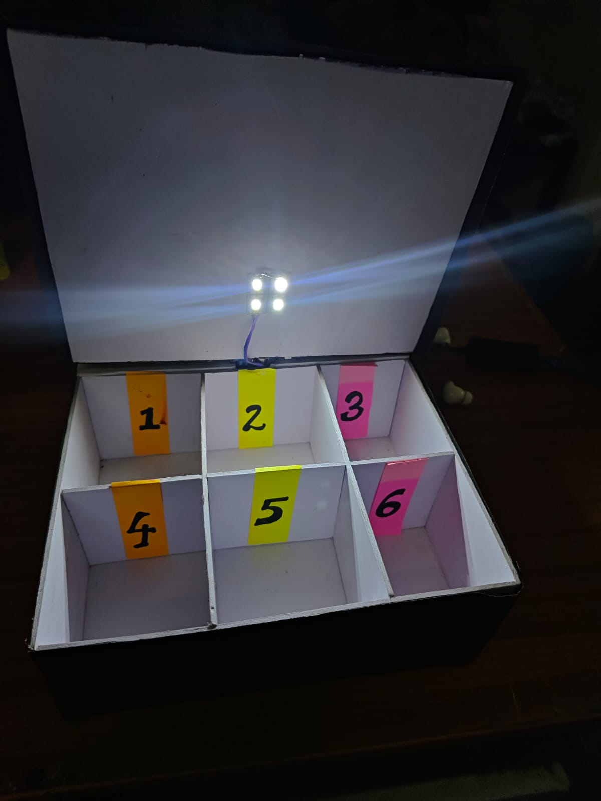
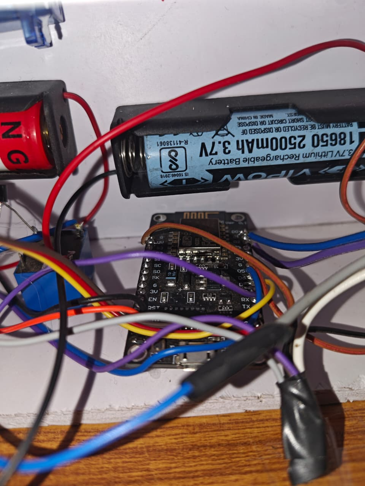
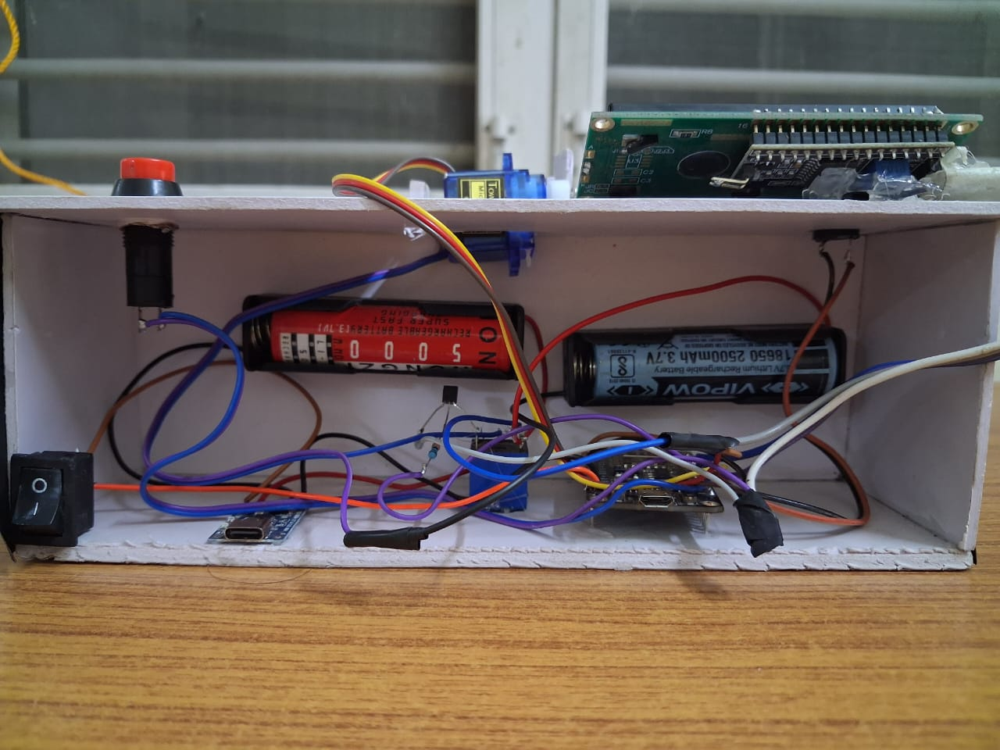
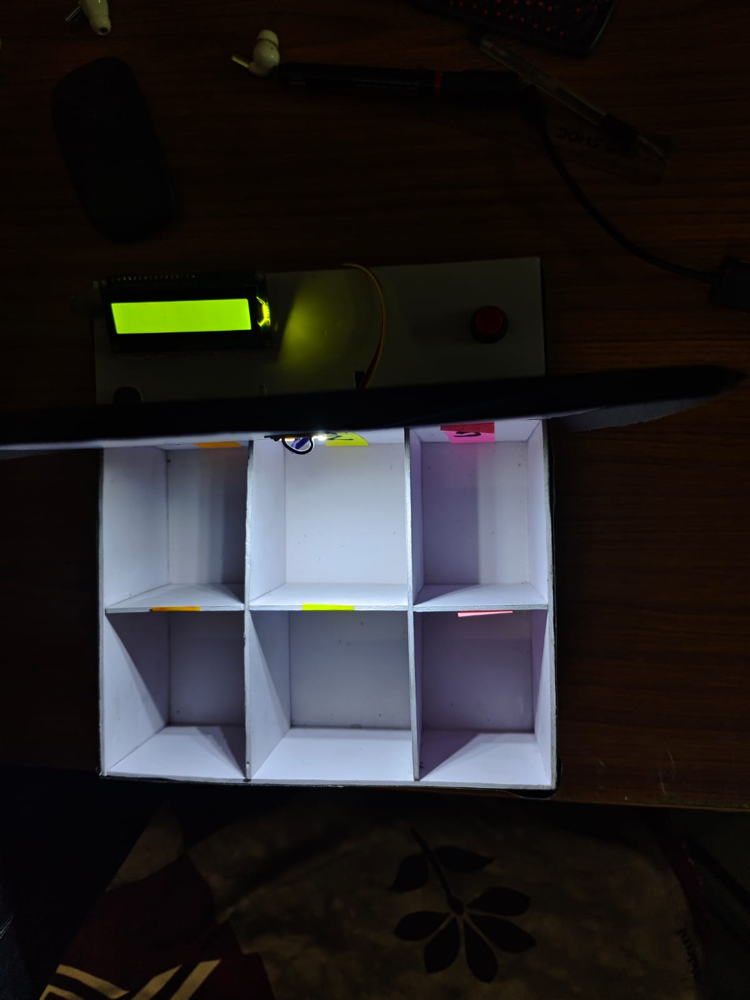

# SAARTHI (सारथि) — Smart Health Companion Box

**An Automated Medication Reminder & Dispensing System**

> "One missed dose can cost your health. One smart reminder can protect it."

[]()
[]()
[]()
[]()
[]()

<p align="center">
  
</p>

---

## Table of Contents

- [Overview](#overview)
- [The Problem & Our Solution](#the-problem--our-solution)
- [Key Features](#key-features)
- [Gallery](#gallery)
- [Hardware — Bill of Materials](#hardware--bill-of-materials)
- [System Architecture](#system-architecture)
- [How It Works](#how-it-works)
- [Software & IoT Integration](#software--iot-integration)
- [Getting Started](#getting-started)
- [Repository Structure](#repository-structure)
- [Future Enhancements](#future-enhancements)
- [Patent Status](#patent-status)
- [Team](#team)
- [License](#license)

---

## Overview

**SAARTHI** ("सारथि" — Sanskrit/Hindi for *charioteer* / *guide*) is an IoT-enabled
medical box that ensures patients take the right medicine, at the right time,
every time — while giving caregivers real-time visibility into adherence from
anywhere via the Blynk app.

It was built as a Project (PR) at **IIIT Jabalpur** by a team of five
Electronics & Communication Engineering students, combining embedded systems,
IoT connectivity, and physical dispensing into a single low-cost device.

## The Problem & Our Solution

| The Challenge | Our Solution |
|---|---|
| Patients frequently forget to take medications on time, leading to poor health outcomes. | An IoT-enabled medical box that alerts patients precisely at dosage times via alarms and an on-device display. |
| Caregivers lack real-time visibility into whether doses were taken or missed. | The box connects to the Blynk app, letting caregivers set schedules and monitor compliance remotely, from anywhere. |

Medication non-adherence isn't a minor inconvenience — it's a well-documented,
large-scale healthcare problem (see the [Research & Pitch Deck](RESEARCH_AND_PITCH.md)
for the full market and evidence base).

## Key Features

- ⏰ **Precision Reminders** — buzzer + LCD alerts fire exactly at each scheduled dose time, synced via NTP.
- 🔒 **Physical Lock & Dispense** — a servo-actuated lid stays locked until it's the correct time or a caregiver-authorized manual open.
- 📱 **Remote Caregiver Dashboard** — the Blynk app lets a caregiver enter up to 4 medicines (name, time, pill count) and monitor them remotely.
- 📊 **Live Compliance Tracking** — every acknowledged (or missed) dose is pushed back to the app, decrementing pill counts automatically.
- 🗄️ **6 Segregated Compartments** — physically separates pills to prevent cross-contamination and mix-ups.
- 💡 **Smart Interior Lighting** — an LED strip auto-lights the compartments on open and shuts off on close, for night-time visibility.
- 🔋 **Battery Powered** — runs on rechargeable 18650 Li-ion cells with a master power switch.

## Gallery

<p align="center">
  
  
</p>
<p align="center">
  
  
</p>

| Photo | What it shows |
|---|---|
| `compartments_lit.jpg` | The 6 color-coded, numbered compartments with the interior LED lit on lid-open. |
| `top_panel_lcd_button.jpg` | The top panel — 16x2 I2C LCD and the single acknowledge/lock-toggle push button. |
| `internal_wiring_full.jpg` | Full internal layout: NodeMCU, SG90 servo, dual 18650 cells, master rocker switch, USB charging module. |
| `mcu_battery_closeup.jpg` | Close-up of the NodeMCU ESP8266 wiring alongside the 18650 Li-ion cell. |

<!-- Still to add: a closed-box exterior shot and a Blynk app dashboard screenshot — drop them into assets/images/ as exterior.jpg and blynk_dashboard.png and add  tags for them here. -->

## Hardware — Bill of Materials

| Component | Function in Project | Connection / Pin |
|---|---|---|
| NodeMCU ESP8266 | Main microcontroller & WiFi IoT brain | Central Hub |
| 16x2 LCD (I2C) | Displays date, time, and next-medicine info | D1 (SCL), D2 (SDA) |
| SG90 Servo Motor | Locking mechanism for the lid | D7 |
| Push Button | Acknowledges dose & toggles lid open/close | D6 (Input Pullup) |
| Active Buzzer | Audible alarm when medication is due | D5 |
| LED Light Strip | Illuminates the internal compartments | D8 |
| 18650 Li-ion Battery | Portable power source | — |

## System Architecture

```
                ┌─────────────────────┐
                │      Blynk App       │
                │ (Caregiver / Remote) │
                └──────────▲───────────┘
                           │ WiFi (Virtual Pins V0–V6)
                ┌──────────┴───────────┐
                │   NodeMCU ESP8266     │
                │  (SAARTHI firmware)   │
                └───┬───┬───┬───┬───┬──┘
                    │   │   │   │   │
              ┌─────┘   │   │   │   └─────┐
              ▼         ▼   ▼   ▼         ▼
          16x2 LCD   Buzzer Button Servo  LED Strip
          (I2C)      (D5)   (D6)  (D7)    (D8)
```

## How It Works

1. **Schedule Set** — Caregiver enters up to 4 medicine names, times, and initial pill counts in the Blynk App.
2. **Time Matching** — The device syncs real time via NTP; when it matches a scheduled dose, `alarmActive` becomes true.
3. **Alert Phase** — The buzzer blinks every 500 ms and the LCD displays "MEDICINE TIME STARTED" while it waits for interaction.
4. **Action & Update** — The user presses the button: buzzer stops, servo unlocks the lid, LED turns on, the pill count decrements, and the update is synced back to the app.

## Software & IoT Integration

| Capability | Implementation |
|---|---|
| **Data Retrieval** | Virtual Pins `V0` (names), `V1` (times), `V2` (counts) pull comma-separated schedule data from the Blynk App. |
| **Time Synchronization** | `configTime()` with NTP servers (`pool.ntp.org`) keeps accurate real time and computes the countdown to the next dose. |
| **Live Status Updates** | The ESP8266 pushes state back via `V4`/`V5` (next medicine name/time) and `V6` (missed/taken flag). |

## Getting Started

### Prerequisites

- Arduino IDE with the **ESP8266 board package** installed
- Libraries: `Servo`, `ESP8266WiFi`, `Blynk` (`BlynkSimpleEsp8266`), `Wire`, `LiquidCrystal_I2C`
- A free [Blynk](https://blynk.io) account + the mobile app, with a datastream template matching `V0`–`V6`

### Setup

1. Clone this repo:
   ```bash
   git clone https://github.com/<your-username>/saarthi-smart-health-box.git
   ```
2. Open `SAARTHI_SmartHealthCompanionBox.ino` in the Arduino IDE.
3. **Before flashing:** move your WiFi SSID/password and `BLYNK_AUTH_TOKEN` out of the source file and into a local, gitignored `secrets.h` — don't commit real credentials (see the security note at the top of the `.ino` file).
4. Wire the components per the [Bill of Materials](#hardware--bill-of-materials) table above.
5. Select **NodeMCU 1.0 (ESP-12E Module)** as the board, select the correct COM port, and upload.
6. Configure the matching datastreams (V0–V6) and a dashboard in the Blynk app.

## Repository Structure

```
saarthi-smart-health-box/
├── README.md
├── RESEARCH_AND_PITCH.md
├── SAARTHI_SmartHealthCompanionBox.ino
├── Smart_Medical_Box_Presentation.pptx
├── LICENSE
└── assets/
    ├── images/
    │   ├── compartments_lit.jpg
    │   ├── top_panel_lcd_button.jpg
    │   ├── internal_wiring_full.jpg
    │   └── mcu_battery_closeup.jpg
    └── docs/           # patent filing receipt / IP documents
```

## Future Enhancements

- **Biometric Security** — a fingerprint sensor so only the authorized patient can open the box.
- **Battery Management** — ESP8266 deep-sleep modes to extend battery life from days to months.
- **Vision/Camera Integration** — an ESP32-CAM to visually verify actual ingestion, not just that the lid opened.
- **Voice Assistant Integration** — Blynk webhooks to Alexa/Google Assistant to announce medicines out loud.

See [RESEARCH_AND_PITCH.md](RESEARCH_AND_PITCH.md) for the full roadmap, market sizing, and competitive pricing analysis.

## Patent Status

Patent application filed for the SAARTHI medication reminder and dispensing
mechanism.

<!-- Add your filing receipt / application number here once available, e.g.: -->
<!-- - **Application No.:** XXXXXXXXXX -->
<!-- - **Filing Date:** DD-MM-YYYY -->
<!-- - **Status:** Applied / Under Examination -->
<!-- See `assets/docs/patent-application-receipt.pdf` -->

## Team

Built by ECE undergraduates at **IIIT Jabalpur**:

| Name | Roll No. |
|---|---|
| Rohan | 24BEC104 |
| Aftab | 24BEC076 |
| Dhruv | 24BEC032 |
| Prachetus | 24BEC093 |
| Samarth | 24BEC107 |

## License

This project is licensed under the MIT License — see the [LICENSE](LICENSE) file
for details. *(Choose a different license if your patent filing requires
restricted code sharing — see the note in the [Getting Started](#getting-started) steps for adding it to GitHub.)*
